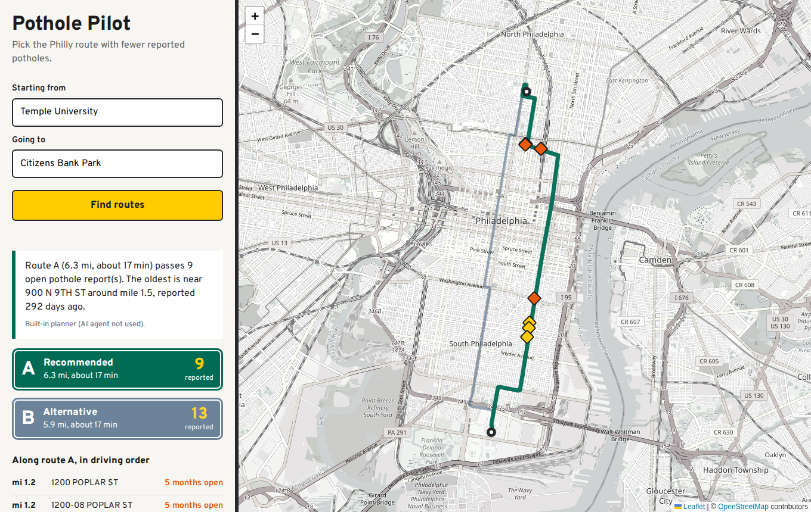

# Pothole Pilot (Philly Pothole Agent)

Type where you are and where you are going in Philadelphia. An AI agent looks up
both places, fetches the driving routes, scans each one against the city's live
311 data for open pothole reports, and recommends the smoother drive, with a map
of every reported pothole along the way. Product home: [potholejawn.com](https://potholejawn.com).



Example from live data: Temple University to Citizens Bank Park. One route passes
9 open pothole reports, the other 13, for the same 17-minute drive.

The repo also includes a second agent, a 311 **accountability analyst**, that
answers open-ended questions ("where is the city slowest at fixing potholes?") by
writing and running guarded SQL. Both share one agent loop.

Built at the Code & Coffee Philadelphia AI Agent Hackathon, September 20, 2026.

## Why

Philadelphia publishes every 311 request since 2014 (about 6 million rows), but
answering a real question takes SQL skills and knowledge of the data's quirks.
In 2026 the city closes illegal-dumping reports in about 4 days, while roughly
19% of pothole reports and 81% of abandoned-vehicle reports are still open.
Residents, journalists, and council staff should be able to find that out by asking.

## How it works

```
"Temple University" -> "Citizens Bank Park"
        |
   trip agent (Claude + tools)                      pothole_agent/trip.py
        +-- geocode_address   US Census geocoder, OpenStreetMap fallback
        +-- find_routes       OSRM: main route plus alternatives
        +-- scan_route        PostGIS query on the city's 311 API: open
        |                     'Street Defect' reports within 30 m of the route
        +-- recommend_route   records the choice as structured output
        |
   map UI (Flask + Leaflet)                         pothole_agent/webapp.py
```

The agent decides which tools to call and in what order, weighs pothole count,
report age, and drive time, then explains its pick. Every step it took is shown
in the UI under "What the agent did", including token usage.

The analyst agent (`pothole_agent/agent.py`, `tools.py`) uses `get_schema`,
`list_categories`, and `run_sql`. When a query fails, the error goes back to the
model, which fixes the SQL and retries. The "Ask the analyst" box in the UI
streams this agent's steps live and shows every SQL query it runs.

## Reliability and safety

- **Graceful degradation**: if the API key is missing or the model call fails,
  a plain-Python planner produces the same map and a simpler briefing. If the
  agent skips a route, `ensure_complete` scans it anyway. The demo never dies.
- **The model never writes the route SQL.** It is built in `routing.py` from
  validated numbers only, and the search radius is clamped to 10 to 100 m.
- **Geofence**: every coordinate must fall inside a Philadelphia bounding box.
- **Browser safety**: API data is inserted with `textContent`, never parsed as
  HTML; CDN assets are pinned with Subresource Integrity hashes.
- **Honest framing**: markers are resident reports, not verified potholes, and
  the UI says so.
- **Read-only SQL guardrail** (`pothole_agent/guardrails.py`): the model's SQL is
  treated as untrusted input. Single SELECT only, table allowlist, no comments,
  no admin functions, results capped at 200 rows.
- **Step limit**: a run stops after 12 model turns, so it cannot loop forever.
- **Full audit trail**: every thought, tool call, SQL query, error, and token
  count is written to `runs/run-<timestamp>.jsonl`.
- **Honest analysis rules**: the agent reports the open-case share next to any
  time-to-close figure, and does not confuse "more reports" with "more potholes".
- **Tests** run with a fake model client, so no API key or network is needed.

## Setup

```bash
python3 -m venv .venv && source .venv/bin/activate
pip install -r requirements.txt
cp .env.example .env          # then add your ANTHROPIC_API_KEY
```

## Run

```bash
python -m pothole_agent.webapp                    # map UI at http://127.0.0.1:5000
python -m pothole_agent.cli                       # analyst agent, default question
python -m pothole_agent.cli "Which zip codes wait longest for abandoned car removal?"
```

## Test

```bash
pytest -q
```

## Data source

[OpenDataPhilly 311 Service and Information Requests](https://opendataphilly.org/datasets/311-service-and-information-requests/),
queried live through the city's public Carto SQL API. No API key is required for the data.
Geocoding: US Census Geocoder and OpenStreetMap Nominatim. Routing: the public OSRM
demo server (fine for a demo; self-host OSRM for real traffic). Map tiles: OpenStreetMap.

## Tools used

Python 3.12, Anthropic API (Claude, tool use), Flask, Leaflet, PostGIS via the City of
Philadelphia Carto SQL API, OSRM, US Census Geocoder, Nominatim, pytest.

## License

MIT
