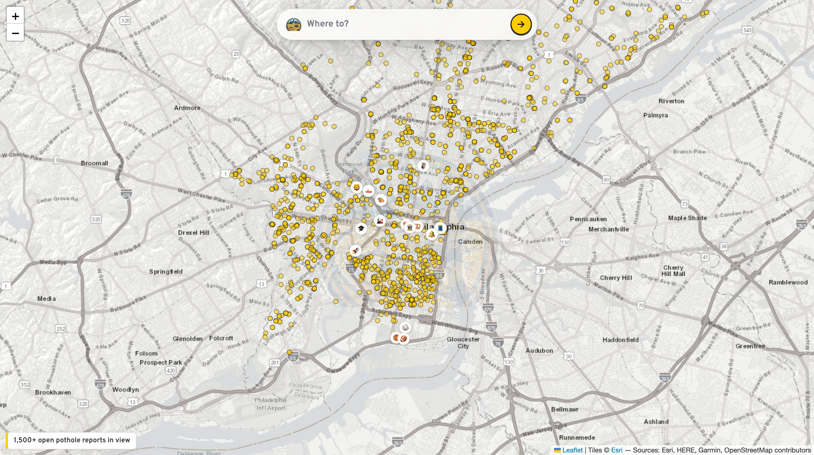
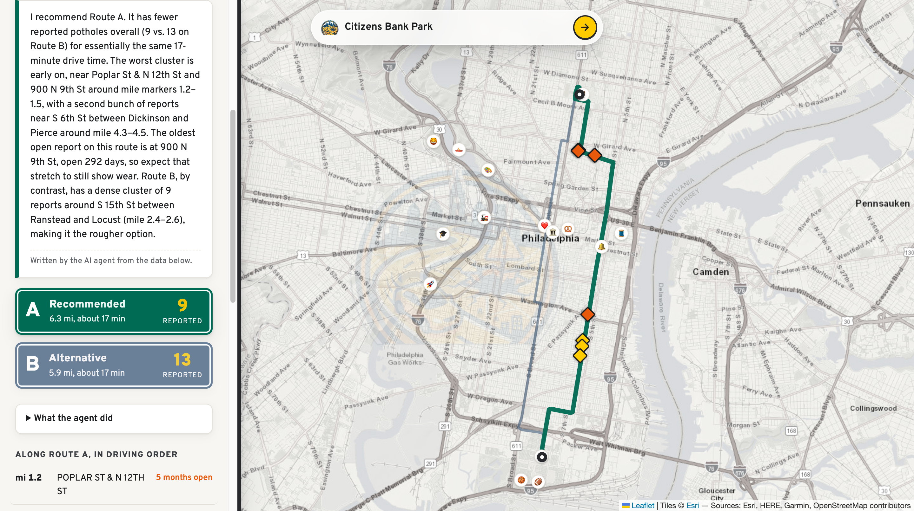
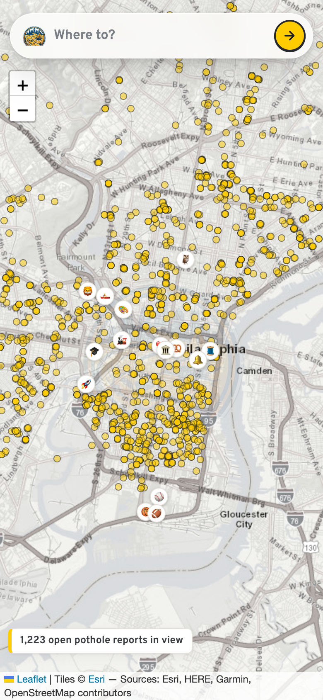

<div align="center">


# potholejawn

**An AI agent that scans Philadelphia's live 311 data — 5.9 million rows — to route you around the potholes.**

[](tests)
[](pyproject.toml)
[](LICENSE)
[](https://potholejawn.com)



*Every yellow dot is an open 311 pothole report, live from the city — 1,500+ in view before you type anything.*

</div>

Type where you are and where you are going in Philadelphia. An AI agent looks up
both places, fetches the driving routes, scans each one against the city's live
311 data for open pothole reports, and recommends the smoother drive, with a map
of every reported pothole along the way.

Built solo by David Pugliese at the **Code & Coffee Philadelphia AI Agent Hackathon, September 20, 2026**.

## Try it

Live at **[potholejawn.com](https://potholejawn.com)** (also [potholejawn.app](https://potholejawn.app)) — installable to a phone home screen as a PWA.

- The map opens on **every open pothole report in Philly right now**, plotted citywide and clickable.
- Type a destination into the **"Where to?" pill** — try `Citizens Bank Park` from `Temple University`. Real result from live data: same 17-minute drive, one route passes 9 open pothole reports, the other 13.
- Or skip typing: tap a **landmark chip** (Liberty Bell, the Rocky steps, the Pennovation Center 🚀 — where this was built) and hit **From here** / **To here**.
- After a trip, open **"What the agent did"** for the full audit trail, or ask the **311 analyst** an open-ended question ("where is the city slowest at fixing potholes?") right in the panel.

## Features

**Trip agent** — geocodes both endpoints, pulls the main route plus alternatives
from OSRM, runs a PostGIS query against the city's live 311 API for open
"Street Defect" reports within 30 m of each route, weighs pothole count, report
age, and drive time, and recommends a route with a plain-language briefing.
Agent steps stream to the panel live over Server-Sent Events, so you watch it
think instead of staring at a spinner.

**311 accountability analyst** — answers open-ended questions by writing and
running guarded SQL against the full 5.9M-row dataset, reading its own errors
and retrying. Available from the "Ask the analyst" box in the panel or the CLI.
Both agents share one generic tool loop.

**Map-first UI** — full-viewport map with a floating "Where to?" search pill, a
slide-in results panel on desktop and a bottom sheet on mobile, a citywide layer
of every open pothole report, clickable landmark chips, route signs (A/B with
report counts), the brand emblem as a map watermark, and PWA install support.

## Screenshots

| Desktop — trip result | Mobile |
|---|---|
|  |  |

## Why

Philadelphia publishes every 311 request since 2014 (about 6 million rows), but
answering a real question takes SQL skills and knowledge of the data's quirks.
In 2026 the city closes illegal-dumping reports in about 4 days, while roughly
19% of pothole reports and 81% of abandoned-vehicle reports are still open.
Residents, journalists, and council staff should be able to find that out by asking.

## How it works

```
        map-first UI (Leaflet + Flask)              pothole_agent/webapp.py, static/
        citywide pothole layer · "Where to?" pill · landmark chips
                |
"Temple University" -> "Citizens Bank Park"
        |
   trip agent (Claude + tools)                      pothole_agent/trip.py
        +-- geocode_address   US Census geocoder, OpenStreetMap fallback
        +-- find_routes       OSRM: main route plus alternatives
        +-- scan_route        PostGIS query on the city's 311 API: open
        |                     'Street Defect' reports within 30 m of the route
        +-- recommend_route   records the choice as structured output
        |
   agent steps stream back live (SSE) -> slide-in panel / bottom sheet
        route signs · briefing · "What the agent did" audit · ask-the-analyst box
```

The agent decides which tools to call and in what order, weighs pothole count,
report age, and drive time, then explains its pick. Every step it took is shown
in the UI under "What the agent did", including token usage.

The analyst agent (`pothole_agent/agent.py`, `tools.py`) uses `get_schema`,
`list_categories`, and `run_sql`. When a query fails, the error goes back to the
model, which fixes the SQL and retries. The "Ask the analyst" box in the UI
streams this agent's steps live and shows every SQL query it runs.

## Reliability and safety

- **Graceful degradation**: if the API key is missing or the model call fails,
  a plain-Python planner produces the same map and a simpler briefing. If the
  agent skips a route, `ensure_complete` scans it anyway. The demo never dies.
- **The model never writes the route SQL.** It is built in `routing.py` from
  validated numbers only, and the search radius is clamped to 10 to 100 m.
- **Geofence**: every coordinate must fall inside a Philadelphia bounding box.
- **Browser safety**: API data is inserted with `textContent`, never parsed as
  HTML; CDN assets are pinned with Subresource Integrity hashes.
- **Rate limiting**: per-IP and global rate limits on the public deployment's
  agent endpoints.
- **Honest framing**: markers are resident reports, not verified potholes, and
  the UI says so.
- **Read-only SQL guardrail** (`pothole_agent/guardrails.py`): the model's SQL is
  treated as untrusted input. Single SELECT only, table allowlist, no comments,
  no admin functions, results capped at 200 rows.
- **Step limit**: a run stops after 12 model turns, so it cannot loop forever.
- **Full audit trail**: every thought, tool call, SQL query, error, and token
  count is written to `runs/run-<timestamp>.jsonl`.
- **Honest analysis rules**: the agent reports the open-case share next to any
  time-to-close figure, and does not confuse "more reports" with "more potholes".
- **Tests** run with a fake model client, so no API key or network is needed.

## Setup

```bash
python3 -m venv .venv && source .venv/bin/activate
pip install -r requirements.txt
cp .env.example .env          # then add your ANTHROPIC_API_KEY
```

## Run

```bash
python -m pothole_agent.webapp                    # map UI at http://127.0.0.1:5000
python -m pothole_agent.cli                       # analyst agent, default question
python -m pothole_agent.cli "Which zip codes wait longest for abandoned car removal?"
```

## Test

```bash
pytest -q
```

## Data sources

[OpenDataPhilly 311 Service and Information Requests](https://opendataphilly.org/datasets/311-service-and-information-requests/),
queried live through the city's public Carto SQL API. No API key is required for the data.
Geocoding: US Census Geocoder and OpenStreetMap Nominatim. Routing: the public OSRM
demo server (fine for a demo; self-host OSRM for real traffic). Map tiles: Esri World Street Map.

## Tools used

Python 3.12, Anthropic API (Claude, tool use), Flask, Leaflet, PostGIS via the City of
Philadelphia Carto SQL API, OSRM, US Census Geocoder, Nominatim, pytest.

## License

MIT
